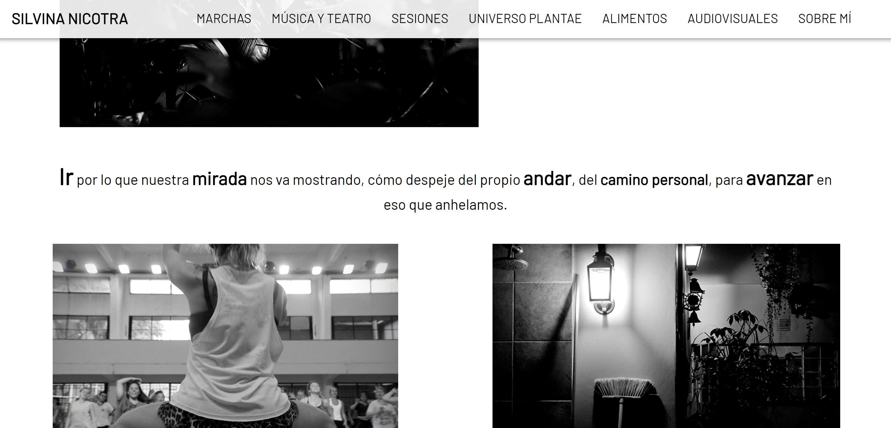
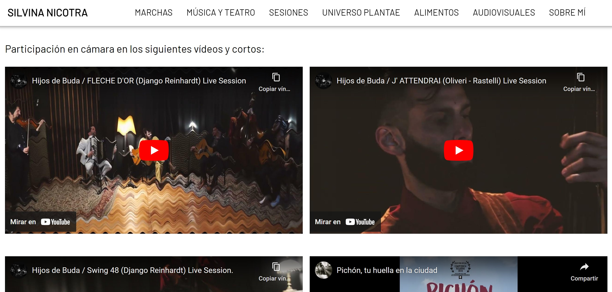

# 📸 Photography Portfolio

Welcome to the Photography Portfolio project! This single-page interface showcases the work of a talented photographer, featuring series of photos and videos she has contributed to as a camera operator.

## Demo

Check out the live demo of the Photography Portfolio [here](https://admirable-cascaron-37509c.netlify.app/).

## Description

This project is a Single Page Interface built with React and Material UI, designed to provide an interactive platform for displaying the photographer's portfolio. Users can explore various series of photographs, watch videos where she has participated as a camera operator, and find her contact information on her website.

## Technologies Used

- React
- Material UI
- HTML
- CSS
- JavaScript

## Features

- Interactive homepage
- Series of photographs
- Videos with the photographer as a camera operator
- Contact information on the website

## Screenshots

## Contact

For inquiries or collaborations, please visit the photographer's website where her contact information is available.

Thank you for visiting the Photography Portfolio! 📸
